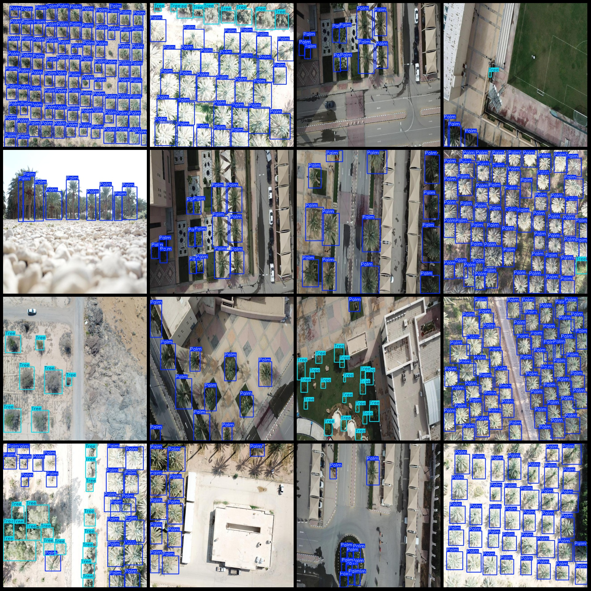

# UAV Perspective Palm Tree Detection Dataset VOC+YOLO Format with 338 Images in 2 Categories

Dataset format: Pascal VOC format plus YOLO format (txt file without split path, only containing jpg images and corresponding VOC format xml files and YOLO format txt files)
Number of images (jpg file count): 338
Number of annotations (xml file count): 338
Number of annotations (txt file count): 338
Number of annotation categories: 2
Repository: firc-dataset
Annotation category names (note that the order of categories in the YOLO format may not correspond to this, but is based on the classes.txt in the labels folder): ["Palm", "Tree"]
Number of bounding boxes per category:
Palm = 10618
Tree = 1867
Total bounding boxes = 12485
Image resolution: 640x640
Annotation tool used: labelImg
Annotation rules: draw bounding boxes for each category
Important note: No special declarations are made here.
Special notice: This dataset does not guarantee the accuracy of the trained models or weight files.
Image preview:
Annotation examples:

## Images

Here is a pay link on Stripe ( https://buy.stripe.com/3cs8yP7sY87d0vu9AB ). Please contact me lonlonago@foxmail.com after funding $89, and I will send you a complete data files , thank you!

